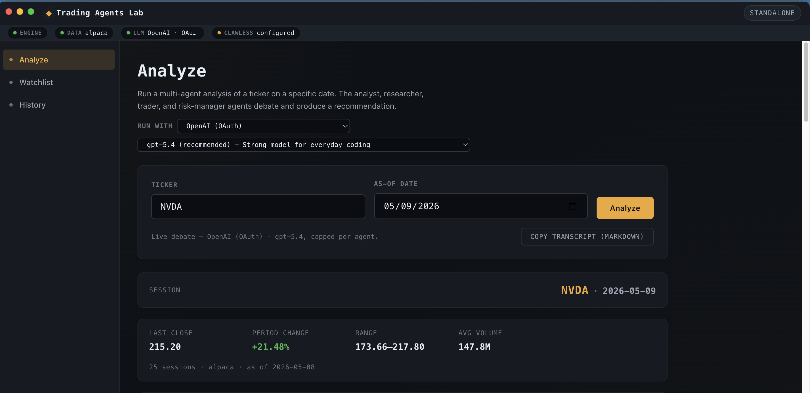
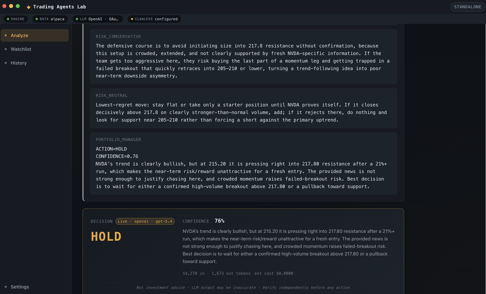
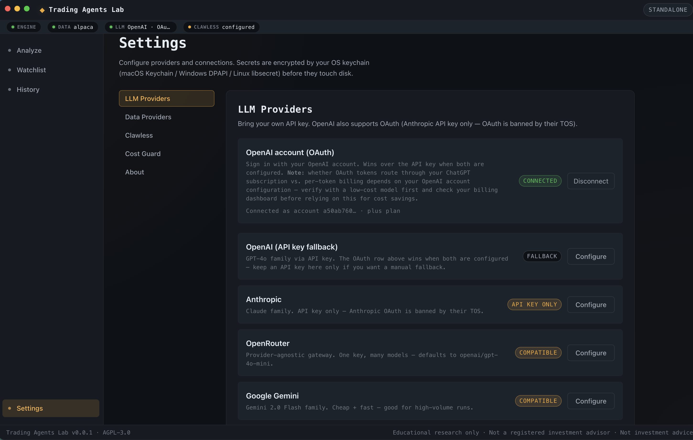
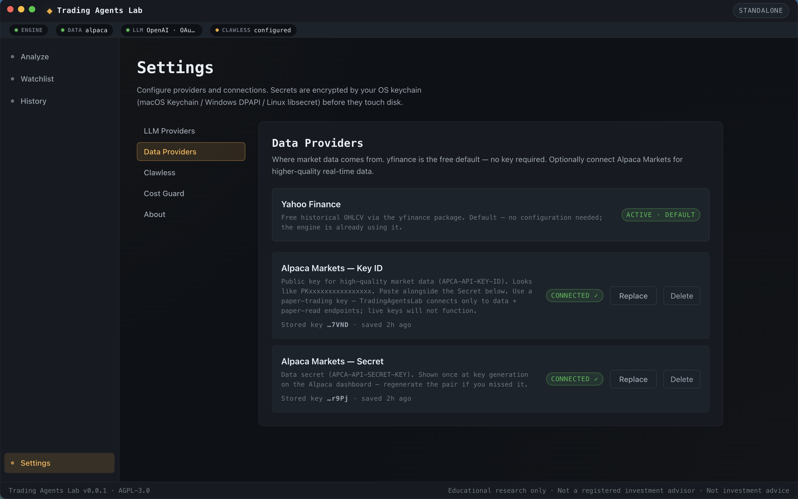
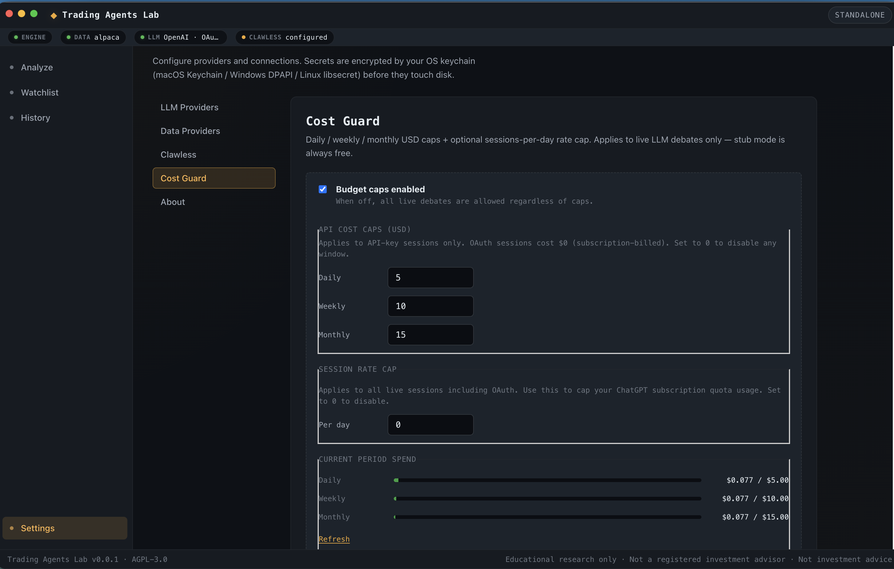
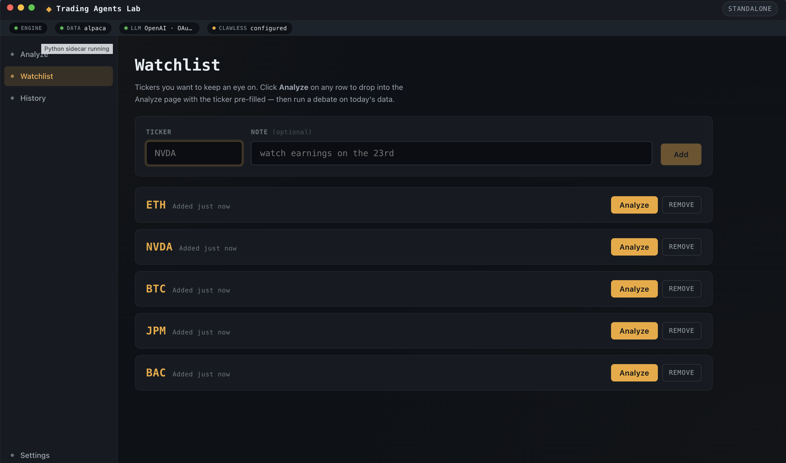
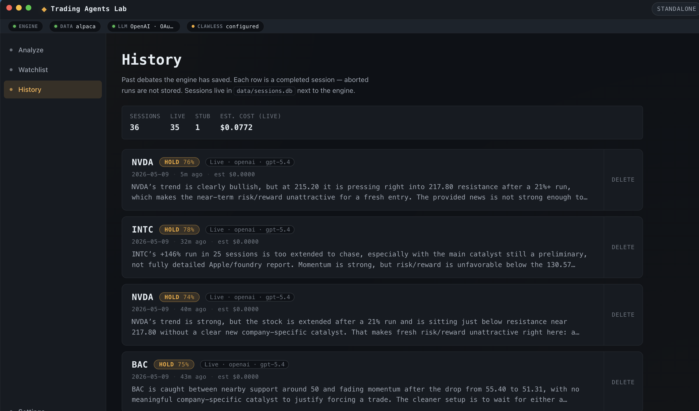
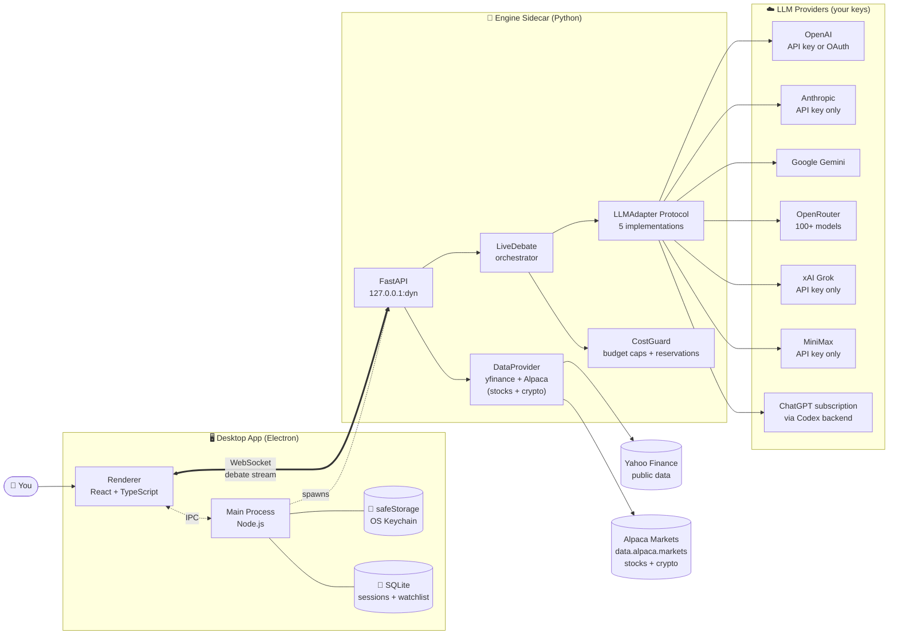
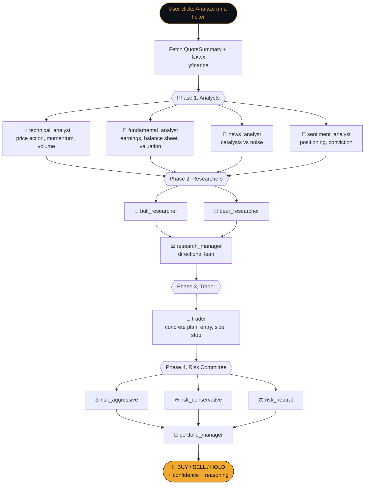
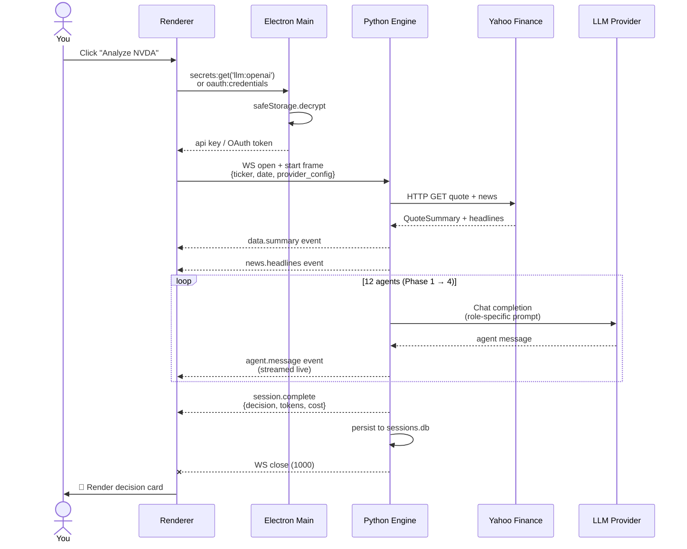

# Trading Agents Lab

> **A free, open-source desktop lab for studying multi-agent LLM analysis of stocks and cryptocurrencies. Bring-your-own-key. Zero data collection.**

[](LICENSE)
[](LICENSE-APACHE)
[](backlog.md)
[](#whats-new-in-v010)
[](#privacy--zero-data-collection)

> **For educational research only.** Trading Agents Lab is **not** a registered investment advisor and does not provide investment, financial, legal, or tax advice. LLM-generated analyses can be inaccurate or hallucinated. Nothing this software produces is a recommendation to buy, sell, or hold any security, cryptocurrency, or other asset. See the [full disclaimer](#disclaimer) below.

Trading Agents Lab is a standalone desktop application that lets you watch multi-agent LLM "trading firms" debate a ticker live, fundamentals analyst, sentiment analyst, news analyst, technical analyst, bull researcher, bear researcher, trader, and a risk-management committee, and produce a transparent, auditable trade thesis with a confidence score. Every step of the debate streams into the UI, every transcript is saved locally, and every API call uses your own key (or your own ChatGPT subscription via OAuth).

It is **not** a trading bot, brokerage, or signal service. It is a lab for *understanding how LLM agents reason about markets*, built for researchers, students, and traders who want to see the full chain of reasoning behind a recommendation rather than a black-box buy/sell call.

## Mission

> *Trading Agents Lab provides a high-quality, professional-grade tool purely for educational purposes. We do not force user adoption and we do not provide trading tools, we provide a free resource for analysis and learning.*

The project also serves as a practical case study for **[Clawdemy.org](https://clawdemy.org)**, an AI education platform, a working example of how multi-agent LLM systems can be designed, prompted, and orchestrated end-to-end. Read the source to learn; fork it to build something new.

---

## Screenshots

### The Analyze flow

| Pick a ticker, provider, model, see live data context | Watch the debate stream → final decision with disclaimer |
|:---:|:---:|
|  |  |
| Compact status strip up top (Engine / Data / LLM / Clawless) is always visible. Data card shows real Alpaca SIP-feed bars before the debate starts. | Risk committee debates → portfolio manager outputs BUY / SELL / HOLD with confidence + reasoning + inline disclaimer. |

### Settings: bring your own everything

| LLM Providers | Data Providers |
|:---:|:---:|
|  |  |
| OpenAI (API key or OAuth, OAuth wins when both are configured), Anthropic, OpenRouter, Google Gemini, xAI Grok, MiniMax, plus local runtimes (Ollama / LM Studio). Green "Connected" pill confirms each. | yfinance is the free zero-config default. Alpaca Markets optional for higher-quality SIP-feed bars + crypto. Both keys encrypted via OS keychain. |

| Cost Guard | Other pages |
|:---:|:---:|
|  |  |
| Daily / weekly / monthly USD caps + optional sessions-per-day rate cap. Live spend bars (green → amber → red). Override modal has a 3-second anti-tamper countdown. | Watchlist for stocks AND crypto, `BTC`, `ETH`, etc. auto-route to the crypto endpoint. Click Analyze to drop straight into a debate with the ticker pre-filled. |

| History |  |
|:---:|:---:|
|  |  |
| Every debate persisted to local SQLite at `data/sessions.db`. Browse past sessions, replay the full transcript, copy as Markdown. Aborted runs aren't stored. | |

> 📸 *More captures (Analyst phase, Researcher phase, Clawless tab) live in [`assets/screenshots/`](assets/screenshots/) for documentation/marketing reuse. See the [capture spec](assets/screenshots/README.md) if you want to refresh them.*

---

## What's new in v0.1.0

- **Two new native LLM providers: xAI Grok and MiniMax.** Grok (4.3 plus the 4.20 family) and MiniMax (M2.x, 204K context) join OpenAI, Anthropic, OpenRouter, Google Gemini, and local runtimes, available in both the Analyze picker and the Telegram bot channel.
- **Refreshed model catalog.** Current frontier models across providers (OpenAI gpt-5.5, Google gemini-3.1-flash-lite GA, xAI grok-4.3), each with a conservative cost ceiling wired into Cost Guard so every model reserves a real budget amount.

---

## What it does

- 🧠 **Multi-agent LLM debate.** A team of 12 specialised agents (4 analysts → 3 researchers → trader → 4-seat risk committee → portfolio manager) reasons about a ticker under your selected LLM, then produces a HOLD / BUY / SELL recommendation with confidence and a complete reasoning trail.
- 📈 **Stocks AND cryptocurrencies.** Type `NVDA` for equities or `BTC`, `ETH`, `SOL`, `BTC/USD`, `BTC-USD` for crypto, the engine auto-detects asset class and routes to the right data endpoint. The fundamental analyst's prompt is asset-class-aware (earnings/balance-sheet for equities, tokenomics/on-chain/macro liquidity for crypto).
- 🔌 **Bring your own LLM provider.** First-class support for **OpenAI** (API key or **ChatGPT OAuth via the Codex backend**), **Anthropic**, **OpenRouter**, **Google Gemini**, **xAI Grok**, and **MiniMax**, plus any **local OpenAI-compatible runtime** (Ollama, LM Studio). Pick provider per session; switch model per provider with persistent memory of your last choice.
- 🗂️ **Two market-data providers.** [yfinance](https://github.com/ranaroussi/yfinance) is the free zero-config default. **Alpaca Markets** (free Basic tier) optional for higher-quality SIP-feed data, auto-routed when your API keys are configured, falls back to yfinance otherwise. For crypto news, the engine falls through to yfinance when Alpaca's news endpoint returns thin coverage for mid- and small-cap tokens.
- 🛡️ **Cost Guard.** Configurable daily / weekly / monthly USD caps + optional sessions-per-day rate cap. TOCTOU-safe atomic reservations prevent parallel debates from blowing the cap. Override modal with 3-second anti-tamper countdown for emergency cases. OAuth subscription paths billed at $0; rate cap protects subscription quotas.
- 💾 **Everything is local. Zero data collection.** SQLite session storage, OS-keychain-backed secrets (Electron `safeStorage`). **No analytics, no telemetry, no error reporting to remote services, no user accounts, no email collection.** Every renderer fetch hits `127.0.0.1`. The only outbound calls are to your configured providers (yfinance, Alpaca, LLMs), verifiable in the source.
- ⌨️ **Native desktop app.** Electron + React + TypeScript on the front, FastAPI + Python sidecar on the back. Cmd+N (new analysis), Cmd+. (stop), Cmd+, (settings), Cmd+1/2/3 (navigate). Real macOS / Windows / Linux app menu.
- 📰 **News integration.** Per-session headline pull from yfinance or Alpaca news (with crypto fallback chain), surfaced in a linked News card and included in transcript export.
- 🪙 **Cost-aware by design.** Token usage and estimated USD cost shown per session for API-key paths. ChatGPT OAuth sessions route through your subscription, no per-token billing, $0 in the ledger.
- 🔓 **Open source under AGPL-3.0.** Free forever. Modify it, study it, self-host it, fork it for personal use. No subscription, no paywall, no premium tier.

## How it works

### The big picture: three cooperating processes



The **desktop** holds your secrets and renders the UI. The **engine** orchestrates the debate, talks to LLMs, and gates spend via CostGuard. They communicate over a local-only WebSocket on `127.0.0.1` with a per-process bearer token. The only outbound calls leaving your machine are to the providers you've explicitly configured (LLM, Alpaca, yfinance). Zero analytics, zero telemetry, see [Privacy](#privacy--zero-data-collection) below.

### The debate pipeline, 12 agents across 4 phases



Each agent is a single chat-completion call to your selected LLM provider, bounded by a hard token cap (`max_tokens=400` per agent, 12 agents per debate). Later agents see the full transcript of earlier agents, debate is sequential, not parallel, so the bull researcher can read the analyst reports, the trader can read the bull/bear arguments, and the risk committee can read the trader's plan.

### What happens when you click Analyze



The whole loop typically takes 5-15 seconds for a `gpt-4o-mini` debate, costing ~$0.001-$0.003. ChatGPT-OAuth debates route through your subscription, no per-token billing, but are subject to subscription rate limits.

For a deeper conceptual walkthrough, see [`docs/kb/how-it-works.md`](docs/kb/how-it-works.md). For the precise on-the-wire event shapes, see [`docs/api.md`](docs/api.md).

## Quick start (development)

> Distribution builds (signed `.dmg` / `.exe` / AppImage) are not yet available, see the [Roadmap](#roadmap). For now, run from source.

**Prerequisites:** Python 3.13, Node.js 20+, npm.

```bash
# 1. Clone
git clone https://github.com/RBJGlobal/TradingAgentsLab.git
cd TradingAgentsLab

# 2. Install Python engine dependencies
pip install -e .
pip install -r requirements.txt

# 3. Install desktop dependencies
cd desktop
npm install

# 4. Launch the app (engine + Vite + Electron all in one)
npm run dev
```

The Electron window opens within a few seconds. The engine status pill in the corner flips from "Starting…" to "Running" (green) once the Python sidecar is ready. Click **Analyze** with the default ticker `NVDA`, pick a provider, and watch the debate stream in.

For backend-only smoke testing without the UI:

```bash
bash tools/dev-smoke.sh
```

## LLM providers

| Provider | Auth | Notes |
|---|---|---|
| **OpenAI** | API key **or** ChatGPT OAuth | OAuth routes through `chatgpt.com/backend-api/codex/responses` (Codex backend), uses your ChatGPT subscription, not per-token API billing. Plan tier auto-detected from the JWT. |
| **Anthropic** | API key only | OAuth is not supported, banned by Anthropic Terms of Service. |
| **OpenRouter** | API key | Access to 100+ models behind one key. |
| **Google Gemini** | API key | Gemini 2.x and 3.x; 3.1 Flash-Lite GA is the cost-efficient pick. |
| **xAI Grok** | API key | Grok 4.3 plus the Grok 4.20 family. |
| **MiniMax** | API key | MiniMax M2.x (Global region, 204K context). |
| **Local LLM** | none (localhost) | Any OpenAI-compatible runtime: Ollama, LM Studio, llama.cpp. Auto-detected, runs fully offline at $0. |

All keys are stored encrypted via Electron's native `safeStorage` (OS keychain on macOS, DPAPI on Windows). Keys never leave your machine and are never logged to disk in plaintext.

## Market data providers

Two providers, auto-selected based on what you've configured:

| Provider | Auth | Best for | Notes |
|---|---|---|---|
| **yfinance** (default) | none | Zero-config use; equities + crypto via `BTC-USD`-style tickers | Free, public Yahoo Finance scraper. Always available. |
| **Alpaca Markets** | API key + secret | Higher-quality equities data via SIP feed; native crypto pairs | Free [Basic tier](docs/kb/data-providers.md) is sufficient, analysis use never approaches the 200-req/min cap. Engine hard-codes `data.alpaca.markets` only; the live trading endpoint never appears in the code. |

Routing logic: when both Alpaca Key ID + Secret are stored under Settings → Data Providers, the engine routes per-debate fetches to Alpaca; otherwise yfinance. **For crypto news**, the engine falls through to yfinance when Alpaca's news endpoint returns thin coverage (Alpaca news is robust for BTC/ETH but sparse for mid- and small-cap tokens).

## Cost Guard

Configurable spending caps with TOCTOU-safe atomic reservations so parallel debates can't blow the cap:

- **Three USD windows** (daily / weekly / monthly), defaults $1 / $5 / $15. Set any to 0 to disable.
- **Sessions/day rate cap**, protects ChatGPT subscription quotas on the OAuth path (where per-token cost is $0 but rate limits still apply).
- **Override modal** with a 3-second anti-tamper countdown. Per-session override only, no "remember for the day" bypass.
- **OAuth-aware policy**, subscription-routed sessions count for rate caps but skip USD caps (cost is genuinely $0 in the ledger).

Configure under Settings → Cost Guard. Current spend visible inline with green/amber/red progress bars.

## Architecture

TradingAgentsLab is built as **two cooperating processes**:

- **Desktop (Electron + Vite + React + TypeScript)**, the user-facing app you interact with. Renders pages, manages secrets (in the Electron main process via `safeStorage`), drives the OAuth flow, and streams debate events into the UI over WebSocket.
- **Engine (Python 3.13 + FastAPI + uvicorn)**, a local sidecar that wraps the upstream `tradingagents` LangGraph core, exposes a small REST + WebSocket API on `127.0.0.1`, and orchestrates the multi-agent debate loop. The engine speaks to LLM providers using a shared `LLMAdapter` protocol with one adapter per provider (OpenAI plus a Codex/OAuth sibling, OpenRouter, Anthropic, Google Gemini, xAI Grok, MiniMax, and local runtimes).

Full design and rationale: [`docs/architecture.md`](docs/architecture.md). Engine HTTP/WS API contract: [`docs/api.md`](docs/api.md). User-facing knowledge base: [`docs/kb/`](docs/kb/).

## Project structure

```
TradingAgentsLab/
├── desktop/             Electron + React desktop app (AGPL-3.0)
├── engine/              Python FastAPI sidecar wrapping the agent core (AGPL-3.0)
├── tradingagents/       Upstream multi-agent core (Apache 2.0, vendored)
├── tools/               Probes, smoke scripts, dev utilities
├── docs/                Architecture, API contract, knowledge base
├── data/                Local SQLite session + watchlist storage (gitignored)
└── assets/              Logos, diagrams, screenshots
```

## Privacy: zero data collection

This is an explicit design principle, not a marketing claim. Verifiable in the source.

- **No analytics SDKs.** No Sentry, Mixpanel, Amplitude, PostHog, Segment, Google Analytics, gtag, none. Greppable.
- **No telemetry beacons, no install pings, no error reporting** to remote services.
- **No user accounts, no email collection, no login**, the app runs entirely without identity.
- **Every renderer fetch goes to `127.0.0.1`**, the local engine sidecar. No external API calls from the UI directly.
- **Engine outbound calls** go only to providers you explicitly configure: Yahoo Finance (yfinance), Alpaca Markets (when keys configured), your chosen LLM provider (when keys configured), and any webhooks you set up in a future release.
- **One soft external identifier**: when you use OpenRouter, our requests carry their recommended `HTTP-Referer` + `X-Title` courtesy headers (their service identifies our app to *them*; not your data to *us*).

Your debates, your transcripts, your decisions, all stay on your machine in `data/sessions.db` (SQLite, plaintext, file-system-permissioned). Want at-rest encryption for transcripts? Store the repo on an encrypted volume (FileVault, BitLocker, LUKS).

## Roadmap

Phase status lives in [`backlog.md`](backlog.md). High-level:

- ✅ **Shipped:** Desktop shell + Python sidecar + end-to-end debate streaming + settings/secrets + multi-provider LLM picker (OpenAI, Anthropic, OpenRouter, Gemini, xAI Grok, MiniMax, local runtimes) + ChatGPT OAuth + history + watchlist + yfinance + Alpaca data adapter + crypto support (auto-routed, asset-class-aware) + Cost Guard with override UX + compact status strip + Telegram bot channel.
- ⏳ **In progress:** Playwright UI tests; KB documentation sweep for crypto + Alpaca + Cost Guard.
- 🔜 **Next:** Optional Clawless gateway tap (Phase 6), webhooks for external broker handoff (Phase 8), launch-prep (Terms of Service, Privacy Policy, brochure marketing site, signed DMG distribution).
- 🚫 **Out of scope, ever** (per locked positioning): native broker execution, live-trading order management, real-money trade routing. Users may fork for personal modifications; PRs adding execution code are rejected upstream.

## License

TradingAgentsLab uses a **dual-license** structure:

| Code | License | File |
|---|---|---|
| All new code in this repo (`desktop/`, `engine/`, `tools/`, `docs/`, etc.) | GNU Affero General Public License v3.0 | [`LICENSE`](LICENSE) |
| Upstream `tradingagents/` core (vendored, lightly modified) | Apache License 2.0 | [`LICENSE-APACHE`](LICENSE-APACHE) |

The combined work is distributed under **AGPL-3.0**. The Apache 2.0 portions remain individually identifiable. See [`NOTICE`](NOTICE) for full attribution.

**What this means in practice:**

- ✅ Free to use, study, and modify for personal, academic, and internal commercial use
- ✅ Free to self-host
- ⚠️ If you offer this software as a network service (SaaS), you must publish your modifications under AGPL-3.0
- ⚠️ If you distribute a modified version, you must publish your modifications under AGPL-3.0
- 💼 Commercial licenses without the AGPL-3.0 copyleft requirement may be available, contact the maintainer.

## Contributing

Contributions are welcome. Please read [`CONTRIBUTING.md`](CONTRIBUTING.md) and sign the [`CLA`](CLA.md) before opening a pull request. Bug reports and feature requests via [GitHub Issues](https://github.com/RBJGlobal/TradingAgentsLab/issues).

## Disclaimer

**For educational and research purposes only.** Trading Agents Lab is **not a registered investment advisor** and does not provide investment, financial, legal, or tax advice. The multi-agent LLM analyses produced by this software may be inaccurate, incomplete, or outdated, large language models can and do hallucinate. Nothing produced by this software is a recommendation to buy, sell, or hold any security, cryptocurrency, or other asset.

Consult a qualified financial professional before making any investment decision. You assume all risk for any action you take based on output from this software. The maintainers and contributors accept no liability for losses arising from use of this software.

The application contains no order-execution capability and never connects to live trading endpoints. If you fork this software and add execution capability for personal use, you assume sole responsibility for regulatory compliance in your jurisdiction.

---

## Acknowledgements

TradingAgentsLab is a derivative work of **[TradingAgents](https://github.com/TauricResearch/TradingAgents)** by [Tauric Research](https://tauric.ai/), the original multi-agent LLM trading framework that powers the debate engine inside this app. The vendored `tradingagents/` directory remains under Apache 2.0 and credit belongs entirely to its authors.

If you use the framework in academic work, please cite the upstream paper:

```bibtex
@misc{xiao2025tradingagentsmultiagentsllmfinancial,
      title={TradingAgents: Multi-Agents LLM Financial Trading Framework},
      author={Yijia Xiao and Edward Sun and Di Luo and Wei Wang},
      year={2025},
      eprint={2412.20138},
      archivePrefix={arXiv},
      primaryClass={q-fin.TR},
      url={https://arxiv.org/abs/2412.20138}
}
```

For the full upstream README, framework architecture diagrams, CLI walkthrough, package usage, agent role descriptions, and Tauric Research's own roadmap, see the **[upstream repository](https://github.com/TauricResearch/TradingAgents)** and the [arXiv paper](https://arxiv.org/abs/2412.20138).
