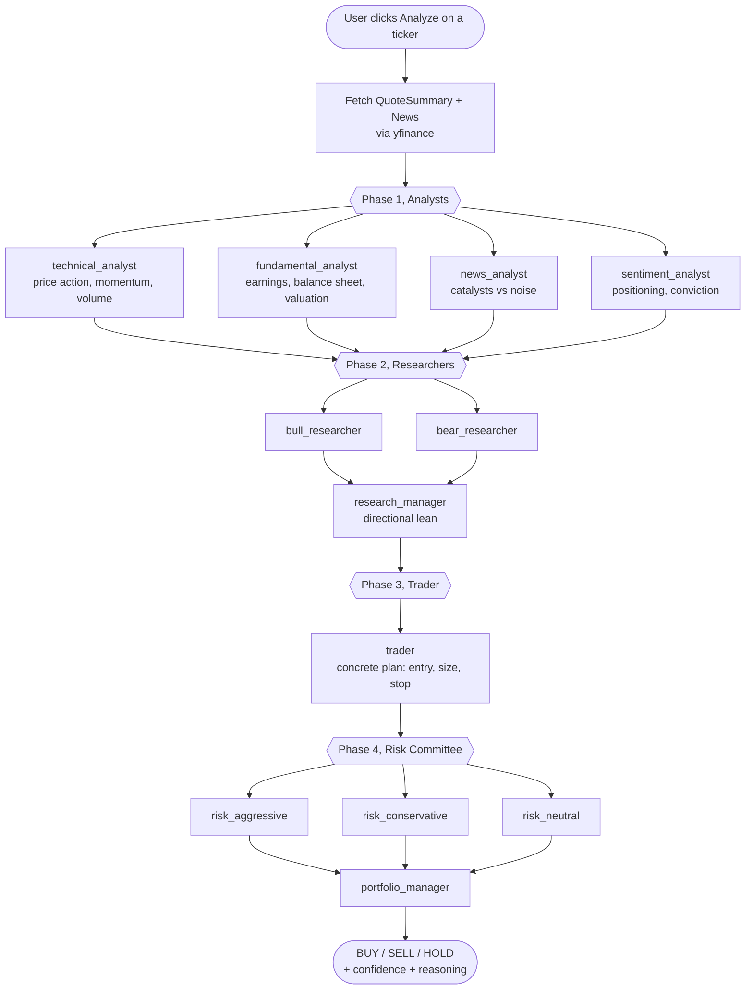
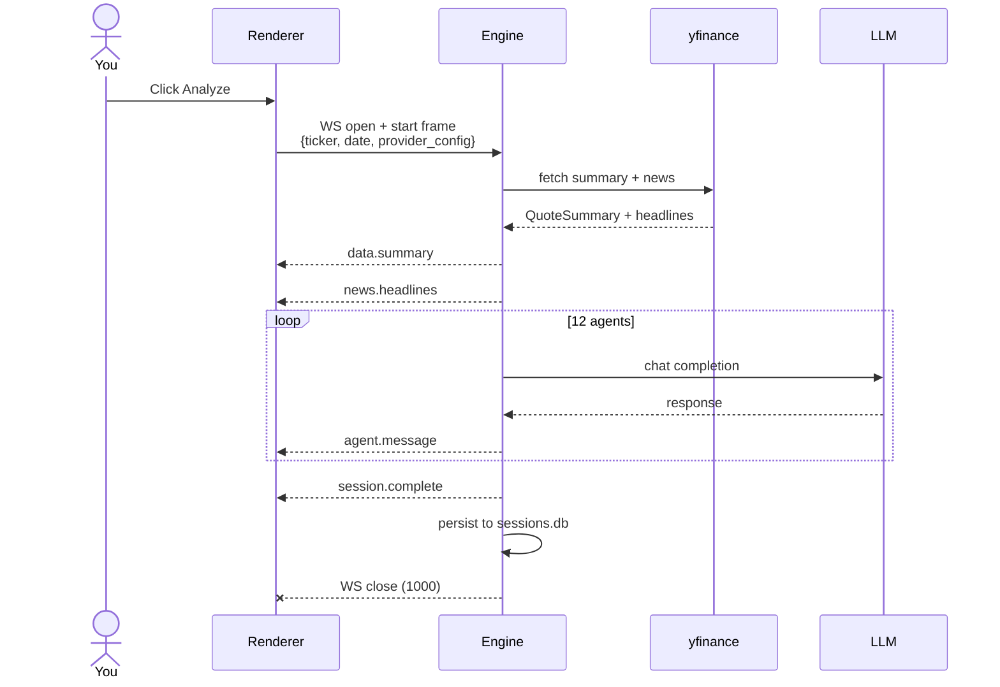

# How It Works

*A conceptual walkthrough of the multi-agent debate pipeline, from ticker input to final decision.*

> **For educational research and paper trading. This is not investment advice.**

---

## Overview

When you click **Analyze**, TradingAgentsLab runs a structured debate among a fixed set of AI agents. Each agent plays a specific role. They work in sequence across four phases:

1. **Analysts**, gather and interpret data
2. **Researchers**, argue the bull and bear cases
3. **Trader**, produce a concrete trade plan
4. **Risk**, stress-test the plan and make the final call

The output is a **decision card**: BUY, SELL, or HOLD, with a confidence level and a brief reasoning paragraph.

This is educational research. The decision is not a trade instruction. Paper trading only.

---

## The pipeline



Each agent is a single chat-completion call to your selected LLM provider. The full transcript of earlier agents accumulates as later agents run, so the bull researcher reads all four analyst reports, the trader reads the bull/bear/manager debate, and the risk committee reads the trader's plan.

---

## The two debate modes

### Stub mode (default when no provider is configured)

When no LLM provider is configured (no API keys saved, no OAuth connected), the engine runs a canned debate from `engine/stub_debate.py`. The structure, phases, agent order, event types, is identical to live mode. The agent messages are templated, but they reference real data fetched from Yahoo Finance:

- last close price
- period price change
- trading range
- average volume
- recent news headlines

Stub mode is useful for verifying that the pipeline, data fetching, and UI rendering work correctly without spending any API credits.

The status cards on the Analyze page show **LLM: Not configured** when the engine is in stub mode.

### Live mode (activated automatically when any provider is configured)

When you have at least one LLM provider configured, OpenAI (API key or OAuth), Anthropic, OpenRouter, or Google Gemini, the engine runs `engine/live_debate.py`. Each agent sends a real prompt to your selected LLM and waits for a response. The agent messages you see in the UI are actual model output, not templates.

The Analyze page header shows a **"Run with"** dropdown listing every connected provider. Pick which one drives a particular debate; pick the specific model for that provider on the second dropdown. Selections persist per (provider, auth-mode) so the app remembers your last choice independently for each combination.

Live mode bounds:

- **12 agents per session** (`MAX_AGENTS_PER_SESSION=12`)
- **400 tokens per agent** (`max_tokens=400` default, hard-capped at 800)
- Sequential, agents run one at a time, in deterministic order

The `session.complete` event in live mode carries `live: true`, the model name, input/output token counts, and an estimated USD cost. OAuth-routed sessions report `estimated_cost_usd: 0` since they bill via subscription, not per token.

---

## Phase 1: Analysts

Four analysts run in sequence. Each analyzes the ticker independently from a different angle.

| Agent | Role |
|---|---|
| `technical_analyst` | Price action, trend, momentum, support/resistance, volume |
| `fundamental_analyst` | Earnings, margins, balance sheet, valuation |
| `news_analyst` | Recent headlines, catalysts vs. noise, what is missing |
| `sentiment_analyst` | What tape + headlines imply about positioning and conviction |

Each analyst receives the same context block: the ticker, the trade date, and the `QuoteSummary` (last close, period range, average volume) plus up to 6 recent news headlines. Later agents see the prior turns of the debate as it accumulates, so each agent has the full context of what has already been said.

---

## Phase 2: Researchers

Two researchers argue opposing sides, then a manager adjudicates.

| Agent | Role |
|---|---|
| `bull_researcher` | Strongest defensible long case anchored on the data |
| `bear_researcher` | Strongest defensible short/avoid case anchored on the data |
| `research_manager` | Weighs both sides; decides which carries the better risk-adjusted argument for the next few sessions |

The research manager produces a directional lean, it is an input to the trader, not the final decision.

---

## Phase 3: Trader

A single trader agent takes all analyst and researcher output and produces a concrete trade plan: whether to enter, suggested size posture (small starter / standard / sized up), a defined-risk stop level, or a HOLD if no entry is warranted.

---

## Phase 4: Risk

Three risk seats stress-test the trader's plan from different angles. The portfolio manager makes the final call.

| Agent | Role |
|---|---|
| `risk_aggressive` | What does the team risk by being too cautious? |
| `risk_conservative` | What does the team risk by being too aggressive? |
| `risk_neutral` | Lowest-regret course of action given both views |
| `portfolio_manager` | Final decision: ACTION=BUY/SELL/HOLD + CONFIDENCE + reasoning |

The portfolio manager emits a structured output that the engine parses to extract the decision and confidence level. The parser is tolerant, if the formatting drifts, it falls back to HOLD / 0.5.

---

## How the decision is produced

At `session.complete`, the engine sends:

```json
{
  "type": "session.complete",
  "ticker": "NVDA",
  "trade_date": "2026-05-08",
  "decision": {
    "action": "HOLD",
    "confidence": 0.55,
    "reasoning": "..."
  },
  "live": true,
  "model": "gpt-4o-mini",
  "input_tokens": 4823,
  "output_tokens": 1922,
  "estimated_cost_usd": 0.00231
}
```

The UI renders the decision card with color coding: green for BUY, red for SELL, amber for HOLD.

---

## Data flow on the wire



The renderer accumulates events and renders them progressively. You see agent messages appear as they arrive. The streaming badge on the session header is visible while the connection is open. After `session.complete`, the engine writes the full session, events, decision, token counts, to `sessions.db` so the History page can replay it later.

---

## Upstream relationship

TradingAgentsLab is forked from [Tauric Research's TradingAgents](https://github.com/TauricResearch/TradingAgents), which implements a full LangGraph-based multi-agent pipeline. The current engine borrows the agent roles and phase structure from upstream but uses a simpler sequential orchestration rather than LangGraph. Full upstream-graph integration is a later phase; the sequential approach is easier to debug and keeps costs predictable.

---

## Further reading

- [Data providers](data-providers.md), what data the analysts see
- [Configuring LLM providers](configuring-llm-providers.md), how to enable live mode
- [OAuth](oauth.md), ChatGPT subscription routing
- [Reading the debate](reading-the-debate.md), how the UI presents the stream
- Engine API contract: [docs/api.md](../api.md)
